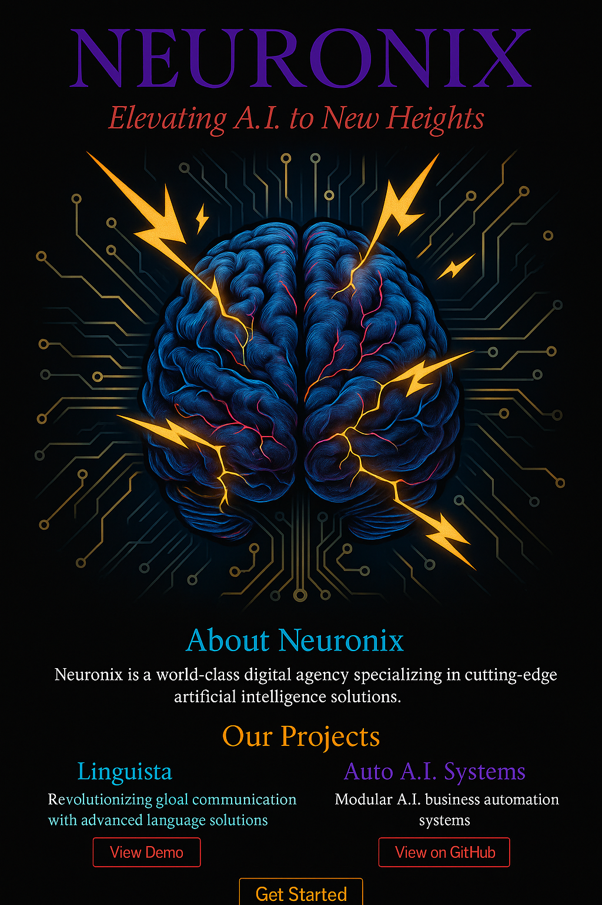

<p align="center">
  
</p>

<h1 align="center">🧠 Auto A.I. Systems</h1>
<h3 align="center"><em>Modular A.I. Business Automation Systems with Scalable Workflows</em></h3>

---

## 🚀 Overview

**Auto A.I. Systems** is a full-stack automation infrastructure built under the Neuronix brand, engineered to help businesses and digital creators scale their operations through AI-powered workflows. Designed with modularity, automation, and clarity in mind, it provides a customizable framework to launch intelligent services quickly, effectively, and with class.

---

## 🧠 Core Features

- **Agent-Based Workflow Engine**  
  Modular Python agents handle tasks like lead gen, content creation, reviews, analytics, and more.

- **Plug-and-Play Microservices**  
  Each module functions independently and can be swapped, scaled, or repurposed as needed.

- **React-Based Frontend UI**  
  Clean interface with dashboard pages, login/register auth flow, and real-time analytics cards.

- **AI Integration Ready**  
  Built to plug directly into OpenAI, Firebase, Supabase, or custom LLMs.

- **End-to-End Automation**  
  Deploy full business pipelines from lead acquisition to nurture to client review without manual work.

- **Modern Architecture**  
  Includes full Docker containerization, environment isolation, and script-based deploys.

- **Data Management Layer**  
  PostgreSQL-ready backend schema, easily migratable via SQL and Python ORM.

- **Test-Driven Development**  
  Pytest-ready backend scripts and modular unit tests included.

---

## 📁 Repo Structure

```
/frontend         → React UI: pages, layouts, cards
/backend          → Python services and orchestration
/agents           → Individual AI agents: content, leads, reviews, etc.
/workflows        → Modular scripts that tie agents together
/docs             → Markdown guides, API docs, setup instructions
/tests            → Unit + integration testing framework
.env.example      → Environment variable template
Dockerfile        → For containerized deployment
```

---

## 🔧 Tech Stack

- **Frontend**: React, TailwindCSS  
- **Backend**: Python, Flask or FastAPI (agent-oriented services)  
- **Database**: PostgreSQL  
- **AI**: OpenAI, custom prompt engines  
- **Deployment**: Docker, GitHub, Vercel-ready  
- **Versioning**: Git, GitHub Desktop  

---

## 🌐 How to Run It

```bash
# Frontend
cd frontend
npm install
npm start

# Backend
python -m venv venv
source venv/bin/activate
pip install -r requirements.txt
python main.py
```

---

## 🧭 Goals

- Host this repo on GitHub under full Neuronix branding  
- Deploy frontend to Vercel or GitHub Pages  
- Connect backend services to hosted DBs and AI APIs  
- Build an accessible GUI that displays intelligent insights, automates execution, and elevates business flow  

---

## 🖼️ Logo

`neuronix-logo-detailed.png`  
Already uploaded and used in this README. No action needed unless renaming.

---

## 💼 Project by Slum (Paul McDowell)  
Part of the **Neuronix** initiative to power the next era of creative and business autonomy with AI.

---
